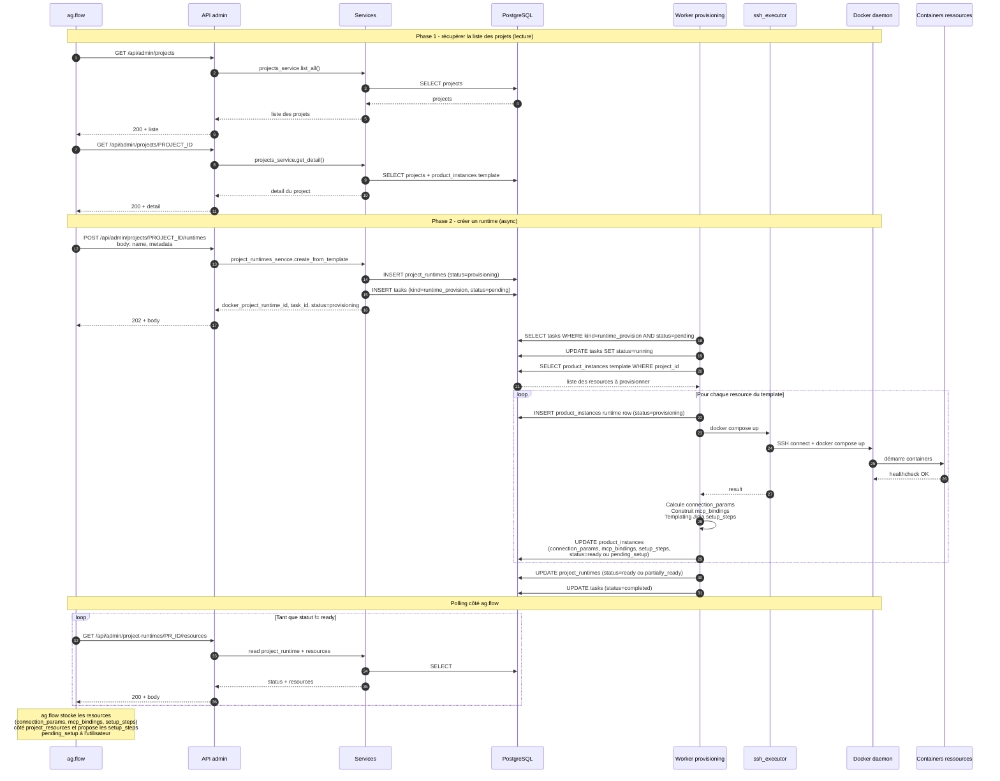
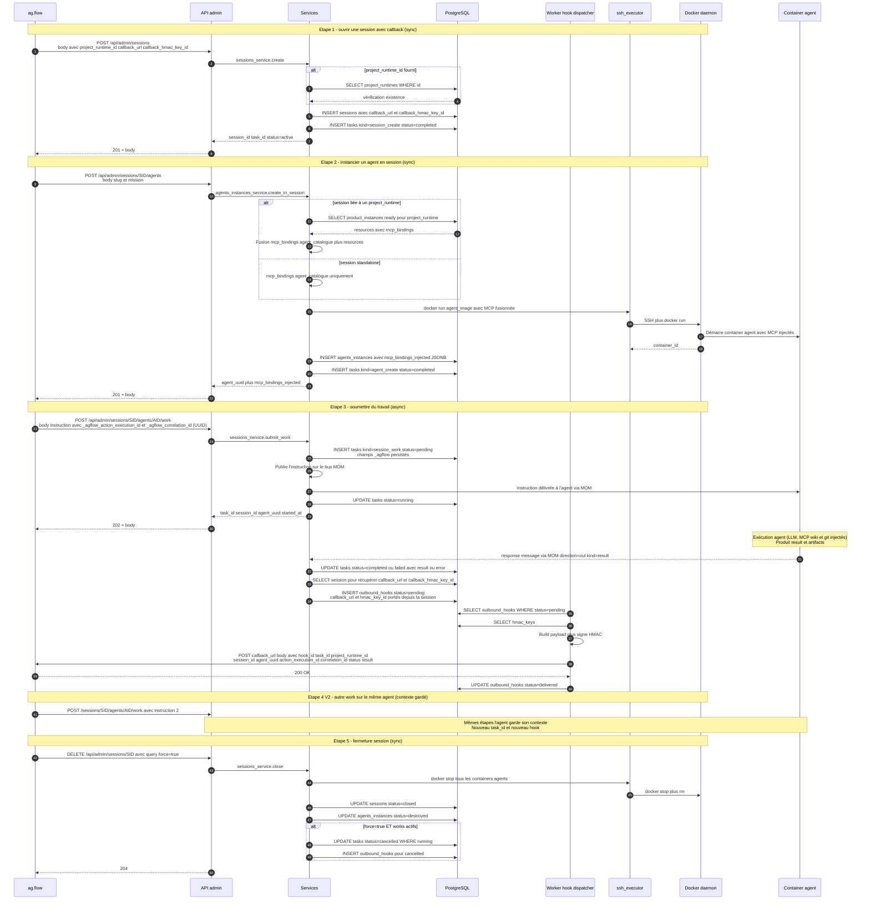
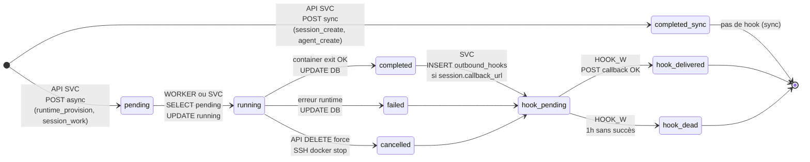
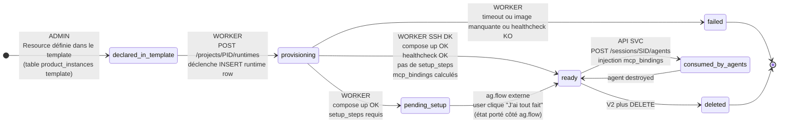
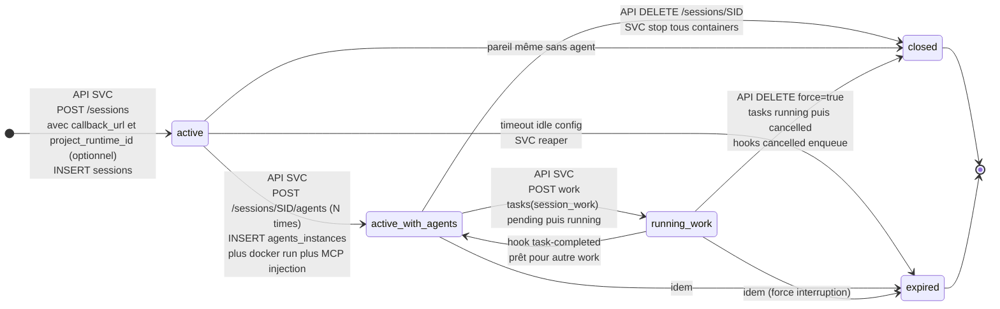
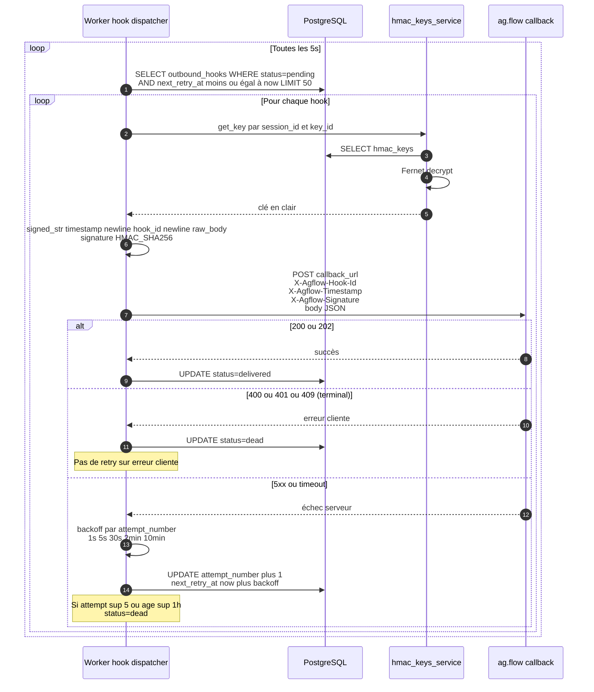
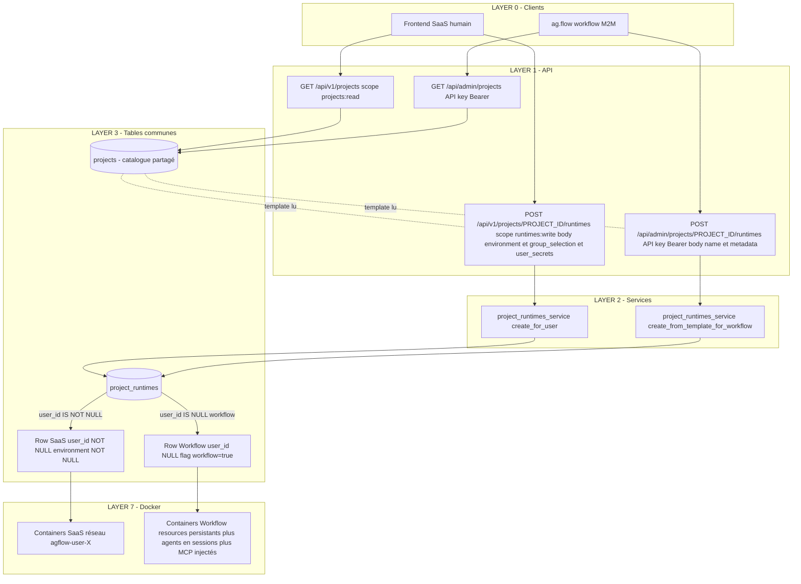

# Diagrammes des flux — agflow.docker × workflow ag.flow

> Diagrammes mermaid issus des contrats `docker-orchestration-flow.md` v5 et
> `hook-docker-task-completed.md` v5.

> **À copier dans le projet workflow** : les diagrammes sont génériques (pas
> de référence à une implémentation Docker spécifique). Conserver la version
> v5 pour traçabilité.

> **Modèle clé V5** :
> - Catalogue = liste des **projects** (templates pré-configurés).
> - Phase 1 : `GET /projects`. Phase 2 : `POST /projects/{id}/runtimes` →
>   provisioning auto + polling `GET /project-runtimes/{id}/resources`.
> - Le **callback HMAC vit sur la session** (pas sur le runtime).
> - Tous les identifiants applicatifs sont des **UUID v4** (`task_id`,
>   `correlation_id`, `action_execution_id`, etc.).
> - Auth : **clé API** transportée via Bearer header HTTP (RFC 6750), pas un JWT.

---

## 1. Bootstrap d'un project_runtime depuis un projet du catalogue

Phase 1 : récupérer la liste des projets. Phase 2 : créer un runtime à partir
d'un `project_id` — Docker provisionne automatiquement les resources, ag.flow
polle le statut.



---

## 2. Exécution d'une action : session → agent → work → hook

L'agent est instancié EN session. Le callback HMAC est porté par la session,
réutilisé pour tous les works.



---

## 3. Cycle de vie d'une `task`



---

## 4. Cycle de vie d'une `resource`



---

## 5. Cycle de vie d'une `session`



---

## 6. Mécanisme de retry du hook outbound



---

## 7. Architecture détaillée par layer

```mermaid
graph TB
    subgraph external [EXTERNE]
        AF_OUT[ag.flow workflow POST sortants]
        AF_IN[ag.flow callback POST hooks reçus]
    end

    subgraph layer_api [LAYER 1 - API publique]
        ADMIN_PROJ_GET["GET /api/admin/projects"]
        ADMIN_PROJ_DET["GET /api/admin/projects/PROJECT_ID"]
        ADMIN_PR_POST["POST /api/admin/projects/PROJECT_ID/runtimes - async"]
        ADMIN_PR_RES["GET /api/admin/project-runtimes/PR_ID/resources"]
        ADMIN_SESS_POST["POST /api/admin/sessions - sync"]
        ADMIN_AG_POST["POST /api/admin/sessions/SID/agents - sync"]
        ADMIN_WORK["POST /api/admin/sessions/SID/agents/AID/work - async"]
        ADMIN_SESS_DEL["DELETE /api/admin/sessions/SID - sync"]
    end

    subgraph layer_svc [LAYER 2 - Services métier]
        PJ_SVC["projects_service - existant M7"]
        PR_SVC["project_runtimes_service plus create_from_template"]
        PI_SVC["product_instances_service plus provisioning plus mcp_bindings"]
        AG_SVC["agents_instances_service M5 plus injection MCP"]
        SE_SVC["sessions_service M5 plus project_runtime_id et callback plus submit_work"]
        TK_SVC["tasks_service - NOUVEAU"]
        HK_SVC["outbound_hooks_service - NOUVEAU"]
        HM_SVC["hmac_keys_service - NOUVEAU"]
    end

    subgraph layer_db [LAYER 3 - PostgreSQL]
        T_PJ[("projects - existant templates admin")]
        T_PR[("project_runtimes - ALTER")]
        T_PI[("product_instances - ALTER")]
        T_AG[("agents_instances M5 - ALTER")]
        T_SE[("sessions M5 - ALTER avec callback_url et project_runtime_id")]
        T_TK[("tasks - NOUVEAU")]
        T_HK[("outbound_hooks - NOUVEAU")]
        T_HM[("hmac_keys - NOUVEAU")]
    end

    subgraph layer_w [LAYER 5 - Workers]
        W_PROV["Worker provisioning - NOUVEAU"]
        W_HOOK["Worker hook dispatcher - NOUVEAU"]
    end

    subgraph layer_ssh [LAYER 6 - SSH]
        SSH[ssh_executor existant]
    end

    subgraph layer_dk [LAYER 7 - Docker]
        DK[Docker daemon]
        NET[Docker networks par project_runtime]
        CTR_R[Containers ressources persistants]
        CTR_A[Containers agents plus MCP injectés]
    end

    AF_OUT -->|API key Bearer| ADMIN_PROJ_GET
    AF_OUT -->|API key Bearer| ADMIN_PROJ_DET
    AF_OUT -->|API key Bearer| ADMIN_PR_POST
    AF_OUT -->|API key Bearer| ADMIN_PR_RES
    AF_OUT -->|API key Bearer| ADMIN_SESS_POST
    AF_OUT -->|API key Bearer| ADMIN_AG_POST
    AF_OUT -->|API key Bearer| ADMIN_WORK
    AF_OUT -->|API key Bearer| ADMIN_SESS_DEL

    ADMIN_PROJ_GET --> PJ_SVC
    ADMIN_PROJ_DET --> PJ_SVC
    ADMIN_PR_POST --> PR_SVC
    ADMIN_PR_RES --> PI_SVC
    ADMIN_SESS_POST --> SE_SVC
    ADMIN_AG_POST --> AG_SVC
    ADMIN_WORK --> SE_SVC
    ADMIN_SESS_DEL --> SE_SVC

    PJ_SVC --> T_PJ
    PR_SVC --> T_PR
    PR_SVC --> T_PJ
    PR_SVC --> TK_SVC
    PI_SVC --> T_PI
    PI_SVC --> TK_SVC
    AG_SVC --> T_AG
    AG_SVC --> TK_SVC
    AG_SVC -->|lit mcp_bindings| T_PI
    SE_SVC --> T_SE
    SE_SVC --> TK_SVC
    SE_SVC --> HK_SVC

    TK_SVC --> T_TK
    HK_SVC --> T_HK
    HM_SVC --> T_HM

    T_TK -.poll.-> W_PROV
    T_HK -.poll.-> W_HOOK

    W_PROV --> PI_SVC
    W_PROV --> SSH

    W_HOOK --> HM_SVC
    W_HOOK -->|HMAC POST| AF_IN

    AG_SVC --> SSH
    SE_SVC --> SSH

    SSH --> DK
    DK --> NET
    DK --> CTR_R
    DK --> CTR_A
    CTR_R --- NET
    CTR_A --- NET
```



---

## 8. Cohabitation Phase 1 SaaS Runtimes ↔ Workflow

Les 2 chemins partent du même catalogue de projets, divergent sur l'auth et le
payload de création de runtime, atterrissent dans la même table
`project_runtimes` avec discriminant.



**Note** : depuis v5 le `callback_url` n'est plus sur `project_runtimes` mais
sur **`sessions`**. Le discriminant entre row SaaS et row Workflow se fait
donc uniquement via `user_id` (NULL = workflow, NOT NULL = SaaS humain). Le
champ `callback_url` éventuel sur `project_runtimes` n'est plus nécessaire.

**Invariants à coder côté service** :
```python
# Chaque project_runtime est SOIT SaaS humain SOIT Workflow M2M
# (pas les deux). En V5, c'est trivial : SaaS a user_id, Workflow ne l'a pas.
```

---

## 9. Pour aller plus loin

- `docker-orchestration-flow.md` v5 — endpoints amont (catalogue, runtime, session, agent, work)
- `hook-docker-task-completed.md` v5 — hook outbound HMAC (callback porté par session)
- `docs/functionnalTests/tests/01-09` — tests M5 (modèle de référence session→agent→message)
- `backend/src/agflow/api/public/sessions.py` — implémentation M5 actuelle
- `backend/src/agflow/api/public/projects.py` — Phase 1 SaaS GET projects
- `backend/migrations/076_group_runtimes.sql` — origine `project_runtimes`
- `backend/migrations/085_saas_runtimes.sql` — extension Phase 1 SaaS
- Migration `086_workflow_orchestration.sql` (à créer) — extension Workflow v5
