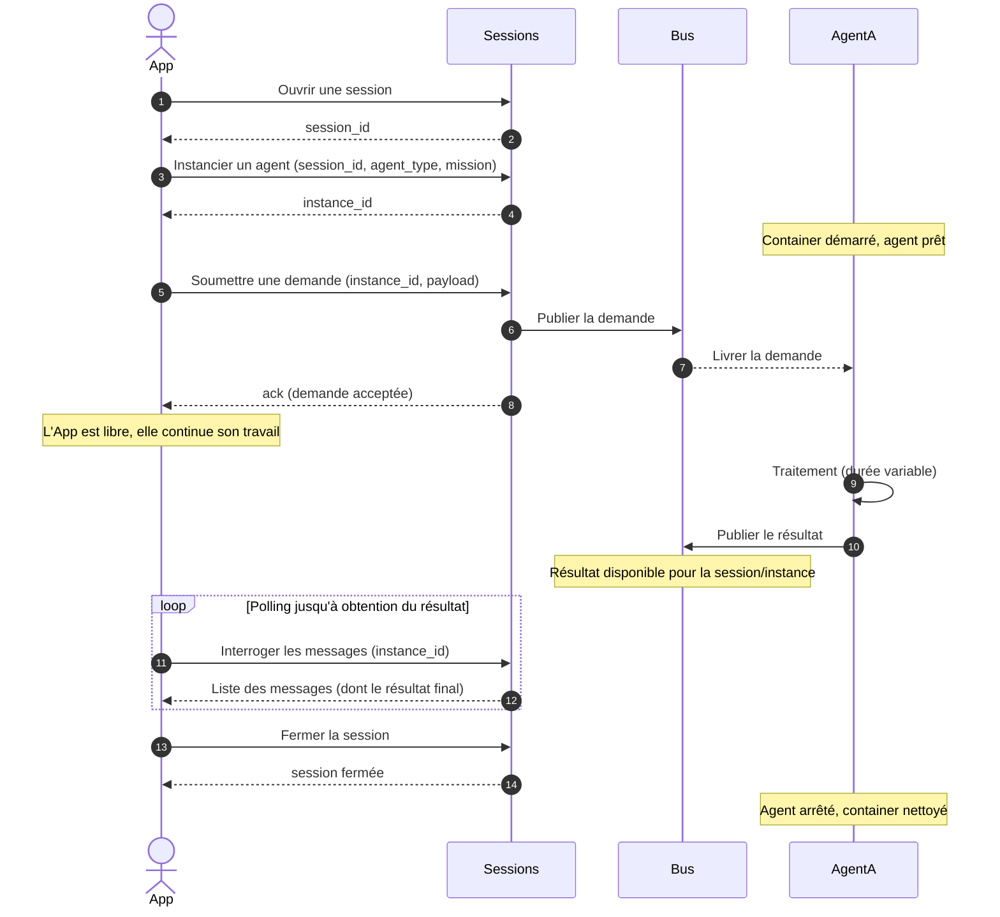

# Cas 01 — Demande minimale à un agent

## Contexte

Une application cliente veut faire exécuter une tâche par un agent d'agflow. C'est le cas
d'usage minimum : une demande, un agent, un résultat. Le client n'a pas besoin
d'infrastructure propre ; il dialogue uniquement avec l'API publique d'agflow.

Le protocole est volontairement **asynchrone** : l'acquittement confirme que la demande
est bien reçue et routée vers l'agent, mais le **résultat** est récupéré par un appel
séparé (polling ou notification via un canal de streaming, selon le client). Cela permet
à l'application de ne pas bloquer son thread sur une tâche qui peut durer plusieurs
secondes à plusieurs minutes.

## Acteurs

| Acteur | Rôle |
|--------|------|
| `App` | Application cliente |
| `Sessions` | API publique d'agflow (lifecycle sessions + agents + messages) |
| `Bus` | MOM bus asynchrone qui découple l'envoi de la demande et la récupération du résultat |
| `AgentA` | Instance d'agent rattachée à la session |

## Workflow

## Points clés

- **Création préalable de session obligatoire** : on n'instancie pas un agent sans session ouverte (règle métier du cycle de vie).
- **L'ack n'est pas le résultat** : il confirme la réception et le routage, rien d'autre. L'application doit distinguer les deux.
- **Identifiant de corrélation** : chaque demande émise retourne un identifiant que l'application peut utiliser pour retrouver son résultat dans la liste des messages (évite de confondre les résultats si plusieurs demandes sont envoyées).
- **Choix polling vs streaming** : le polling est le mécanisme de base, mais l'API offre aussi un canal streaming (hors périmètre de ce cas) pour les applications qui veulent éviter le polling.
- **Fermeture explicite** : l'application doit fermer la session quand elle a fini. Sinon le timeout idle s'en charge, mais avec une latence (2 min par défaut).
- **Isolation** : les messages échangés dans une session ne fuitent pas vers une autre session, même pour le même client.
