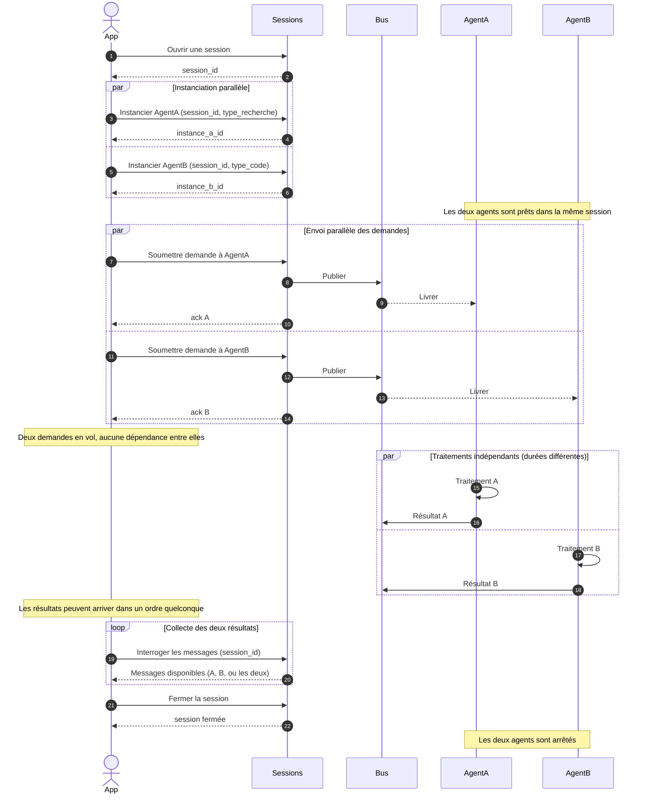

# Cas 02 — Deux agents en parallèle

## Contexte

L'application cliente a deux tâches **indépendantes** à faire exécuter en même temps
(par exemple : une recherche documentaire et une génération de code). Elle instancie
deux agents dans **la même session**, leur envoie chacun une demande, puis récupère
leurs résultats dès qu'ils sont disponibles — dans l'ordre où ils arrivent, pas dans
l'ordre d'envoi.

Ce cas montre que les agents d'une même session fonctionnent **de manière
indépendante** : il n'y a pas de goulot d'étranglement sur la session, et l'application
peut paralléliser ses demandes sans gestion particulière côté bus.

## Acteurs

| Acteur | Rôle |
|--------|------|
| `App` | Application cliente |
| `Sessions` | API publique d'agflow |
| `Bus` | MOM bus, qui isole les flux par instance d'agent |
| `AgentA` | Première instance (ex : spécialiste recherche) |
| `AgentB` | Seconde instance (ex : spécialiste code) |

## Workflow

## Points clés

- **Instanciations et envois peuvent être parallèles** : aucune sérialisation imposée. L'application peut utiliser son propre mécanisme de concurrence (threads, promises, asyncio).
- **Isolation entre agents** : une demande adressée à `AgentA` n'est jamais livrée à `AgentB`, même dans la même session. Le bus filtre par `instance_id`.
- **Ordre d'arrivée des résultats non garanti** : si `AgentB` finit avant `AgentA`, son résultat arrive d'abord. L'application identifie chaque résultat par son identifiant de corrélation.
- **Interrogation par session ou par instance** : l'application peut récupérer les messages d'une instance précise (`instance_id`) ou de toutes les instances d'une session (pour un dashboard, par exemple).
- **Limite simultanée** : le nombre d'agents actifs par session est paramétrable côté plateforme. L'application doit gérer le refus d'instanciation au-delà de cette limite (hors périmètre happy path).
- **Fermeture unique** : fermer la session détruit les deux agents. Pas besoin de les détruire un par un.
