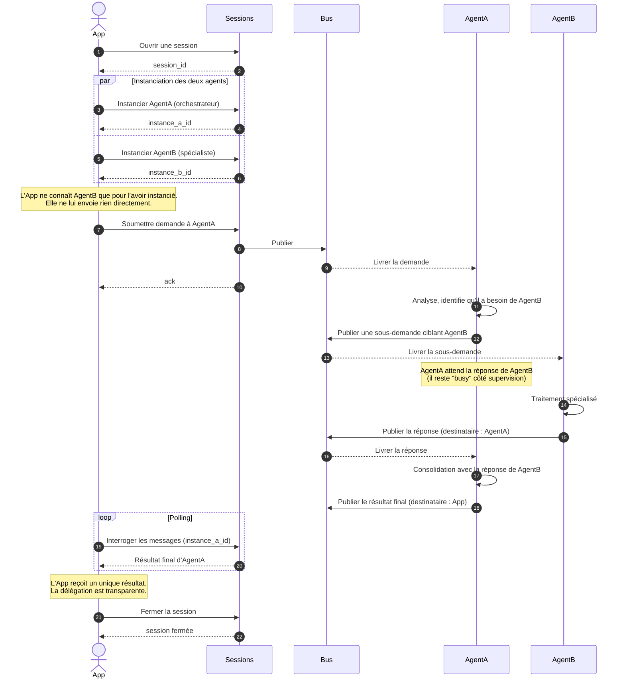

# Cas 03 — Communication inter-agents

## Contexte

L'application cliente a une tâche qui nécessite la **coopération** de deux agents
spécialisés. Elle n'adresse sa demande qu'à **un seul agent "chef d'orchestre"**
(`AgentA`), qui va lui-même solliciter un autre agent (`AgentB`) pour compléter son
travail. Du point de vue de l'application, un seul résultat final remonte — la
délégation interne est transparente.

Ce cas illustre le **routage inter-agents** : `AgentA` peut envoyer une demande à
`AgentB` via le bus sans passer par l'application. Les deux agents vivent dans la
même session (scope commun), ce qui leur donne accès à la même mission et au même
contexte projet.

## Acteurs

| Acteur | Rôle |
|--------|------|
| `App` | Application cliente (ne voit que `AgentA`) |
| `Sessions` | API publique d'agflow |
| `Bus` | MOM bus, qui route aussi les messages entre agents d'une même session |
| `AgentA` | Agent "orchestrateur" qui reçoit la demande et délègue une partie |
| `AgentB` | Agent "spécialiste" sollicité par `AgentA` |

## Workflow

## Points clés

- **Routage explicite** : un message inter-agent porte un destinataire (`route` : agent cible ou rôle), le bus s'en sert pour le livrer à la bonne instance.
- **Parent/enfant de message** : le résultat d'`AgentA` peut référencer la demande initiale de l'`App` comme parent, ce qui permet à l'application de reconstituer la chaîne sans avoir à connaître la sous-traitance.
- **Pas de fuite de conversation vers l'App** : les messages échangés entre `AgentA` et `AgentB` restent visibles côté supervision (traçabilité), mais ne sont pas retournés à l'application dans le flux de messages "de sa demande".
- **État `busy` transitif** : tant qu'`AgentA` attend la réponse de `AgentB`, les deux agents sont marqués `busy` côté supervision. Un timeout agent mal configuré peut donc destroyer prématurément `AgentA`.
- **Pas de partage mémoire** : `AgentA` et `AgentB` ne partagent pas d'état en mémoire ; toute information qu'ils se passent transite par un message. C'est intentionnel — cela permet de remplacer un agent sans rien casser.
- **Une session scope la coopération** : deux agents de sessions différentes ne peuvent pas se parler par défaut. La session est la frontière de confiance et de contexte.
