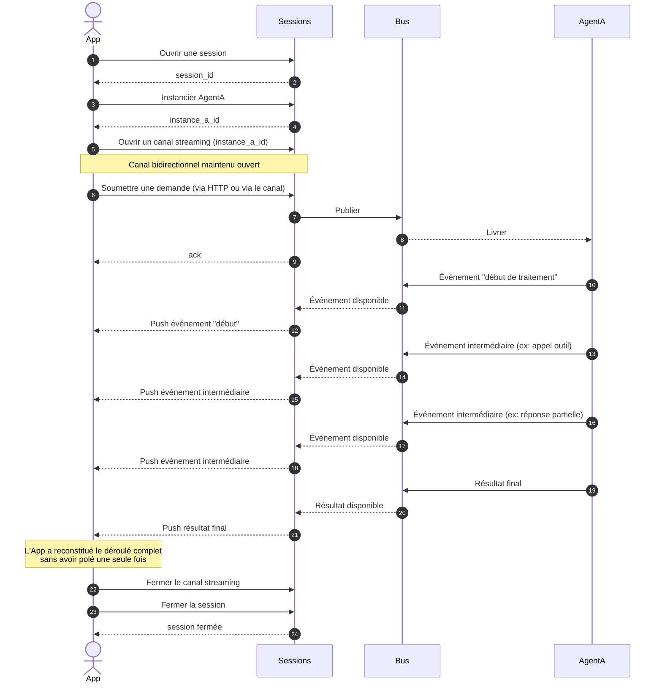

# Cas 05 — Réception des résultats en streaming

## Contexte

Le polling du cas 01 est simple à implémenter mais pénalisant pour une application
réactive (latence moyenne = moitié de l'intervalle de polling, bande passante gaspillée
quand aucun message n'arrive). Pour une UI qui doit afficher les étapes d'un agent au
fil de l'eau (pensée, appel outil, réponse intermédiaire), le client ouvre un **canal
streaming** et consomme les événements au moment où ils sont émis.

Ce cas couvre le **remplacement du polling par un stream** pour un usage interactif :
même flux fonctionnel que le cas 01, mais l'application reste connectée le temps du
traitement et voit apparaître les messages en direct.

## Acteurs

| Acteur | Rôle |
|--------|------|
| `App` | Application cliente (UI temps réel) |
| `Sessions` | API publique d'agflow |
| `Bus` | MOM bus |
| `AgentA` | Agent instancié qui émet plusieurs messages intermédiaires avant le résultat final |

## Workflow

## Points clés

- **Canal ouvert avant ou après la demande** : l'application peut ouvrir le stream avant d'envoyer sa demande (aucun événement manqué) ou juste après (risque de manquer les tout premiers événements émis avant la connexion).
- **Le canal ne remplace pas l'ack HTTP** : la soumission de la demande retourne toujours un ack synchrone. Le stream délivre les événements postérieurs.
- **Déconnexion transparente pour l'agent** : si le client ferme le stream en cours de traitement, l'agent continue son travail. À la reconnexion (ou en polling), l'application retrouvera les événements stockés.
- **Rattrapage via polling** : un client peut alterner stream (temps réel) et polling (reprise après coupure réseau) — les deux interrogent la même source de vérité.
- **Filtre par instance ou par session** : l'application choisit de streamer une seule instance (écran "conversation avec un agent") ou toute la session (dashboard multi-agents).
- **Pas de flow control côté client** : si l'application consomme lentement, les messages s'accumulent côté serveur. Au-delà d'un seuil, le canal peut être fermé pour protéger la plateforme — à traiter comme un cas d'erreur dans une itération future.
