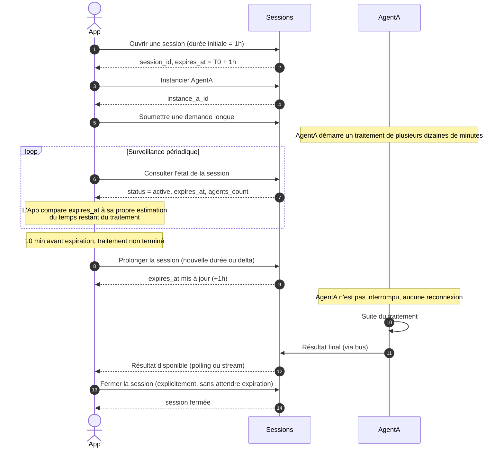

# Cas 06 — Session longue avec extension de durée

## Contexte

Une session agflow a une durée de vie bornée (`expires_at` défini à la création). Pour
une application qui orchestre un travail long (revue de code sur un gros repo, génération
multi-étapes), la durée initiale peut être insuffisante. Plutôt que de fermer et rouvrir
une session (ce qui redémarre les agents et perd le contexte), l'application **prolonge**
la session en place.

Ce cas couvre la **gestion explicite du budget temps d'une session** : détection de
l'approche de l'expiration, décision de prolonger ou pas, et renouvellement sans
interrompre les agents en cours.

## Acteurs

| Acteur | Rôle |
|--------|------|
| `App` | Application cliente avec un travail long à faire exécuter |
| `Sessions` | API publique d'agflow |
| `AgentA` | Agent actif pendant toute la durée étendue |

## Workflow

## Points clés

- **Extension avant expiration, pas après** : une session expirée ne peut pas être ressuscitée. L'application doit prolonger *avant* que `expires_at` soit dépassé.
- **Pas de reconnexion des agents** : l'extension est une mise à jour de métadonnée côté session, les containers d'agents ne sont pas touchés. Aucune perte de contexte en mémoire.
- **Politique de prolongation côté application** : c'est l'application qui décide de prolonger ou pas. Elle peut refuser (ex : budget serveur dépassé) et laisser la session expirer naturellement.
- **Extension répétable** : une session peut être prolongée plusieurs fois. Il appartient à l'application (ou à la plateforme, via un cap admin) de limiter les abus.
- **Timeout idle distinct** : la durée de session ne protège pas contre le timeout idle (agent/session sans activité). Même une session avec une grande `expires_at` peut être fermée automatiquement si plus rien ne se passe dedans.
- **Surveillance côté supervision** : les endpoints admin de supervision montrent les sessions qui approchent de leur `expires_at`, ce qui permet à un opérateur d'alerter une app silencieuse.
