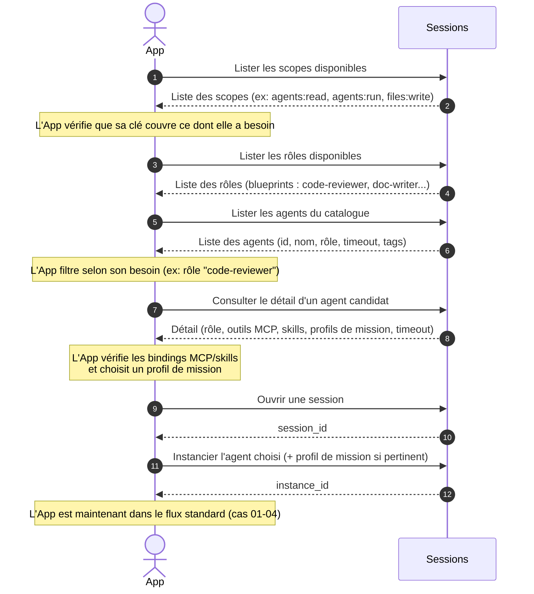

# Cas 07 — Découverte du catalogue avant instanciation

## Contexte

Une application qui intègre agflow pour la première fois (ou qui veut s'adapter
dynamiquement à l'état du catalogue) ne peut pas hard-coder la liste des agents ni
leurs capacités. Elle doit **découvrir** ce qui est disponible, choisir un agent qui
matche son besoin, vérifier qu'il a les scopes et les outils attendus, puis instancier.

Ce cas couvre la **phase de reconnaissance** avant toute action. Il est particulièrement
utile pour une UI qui présente à l'utilisateur final la liste d'agents disponibles, ou
pour un client qui tourne face à plusieurs déploiements agflow potentiellement
hétérogènes.

## Acteurs

| Acteur | Rôle |
|--------|------|
| `App` | Application cliente en phase de découverte |
| `Sessions` | API publique d'agflow (endpoints de découverte + lifecycle) |

## Workflow

## Points clés

- **Scopes avant tout** : une application qui n'a pas le scope requis recevra une erreur d'autorisation au moment d'instancier l'agent. Il est plus ergonomique de vérifier les scopes en amont et d'afficher un message clair (ou de demander un upgrade de clé).
- **Rôle = blueprint, agent = composition** : un rôle est un gabarit (persona + sections de prompt). Un agent est la composition concrète d'un rôle avec un Dockerfile et des outils. L'application choisit toujours un agent (pas un rôle).
- **Profils de mission** : certains agents exposent plusieurs variantes d'utilisation (ex : `strict`/`lenient` pour un code reviewer). Découvrir les profils permet à l'application de sélectionner le bon ton ou la bonne rigueur.
- **Catalogue dynamique** : ajouter/retirer un agent côté admin est visible immédiatement dans la découverte. Une application robuste rafraîchit sa liste régulièrement, pas uniquement au démarrage.
- **Pas de session requise pour découvrir** : les endpoints de découverte ne consomment aucune session. Ils peuvent être appelés avant même de savoir si on va instancier quoi que ce soit.
- **Retombée pédagogique pour l'utilisateur final** : exposer la description d'un rôle ou d'un agent dans l'UI aide l'utilisateur à comprendre pourquoi tel agent est proposé plutôt que tel autre.
