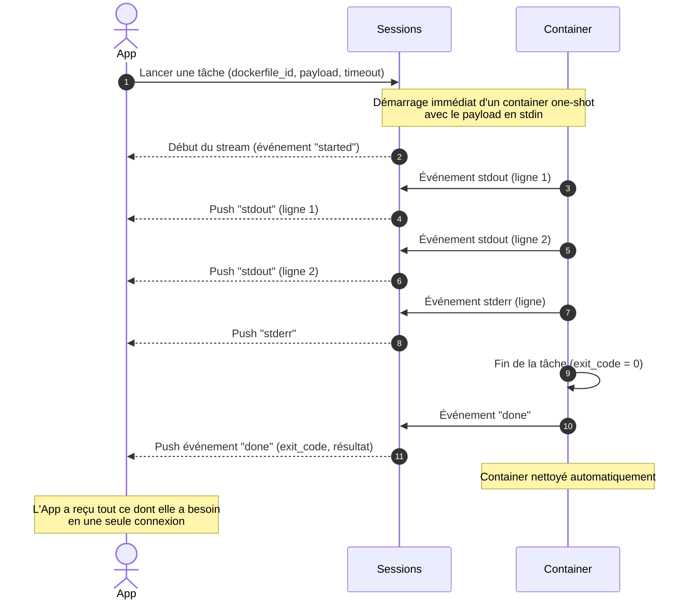

# Cas 08 — Tâche one-shot sans session

## Contexte

Les cas 01-07 s'appuient sur le modèle **session + agent instancié** pour permettre une
coopération longue et traçable. Ce modèle a un coût (ouverture/fermeture de session,
cycle de vie d'instance) qui n'est pas justifié pour un usage ponctuel : un webhook, un
cron, un outil en ligne de commande qui veut juste "exécuter la chose X et ramener la
sortie".

agflow expose un **raccourci** : lancer directement un dockerfile avec un payload, et
consommer le flux d'événements de la tâche en streaming jusqu'à la fin. Pas de session,
pas d'agent persistant, pas de polling.

Ce cas est **complémentaire**, pas concurrent : quand l'application veut une
conversation multi-étapes, elle revient sur le modèle session (cas 01+).

## Acteurs

| Acteur | Rôle |
|--------|------|
| `App` | Déclencheur ponctuel (webhook, cron, CLI) |
| `Sessions` | API publique d'agflow (endpoint de tâche one-shot) |
| `Container` | Container lancé pour la durée de la tâche uniquement |

## Workflow

## Points clés

- **Pas de session, pas d'instance à nettoyer** : l'application n'a rien à fermer. Le container démarre, exécute, et disparaît avec sa sortie.
- **Pas d'historique côté agflow** : une fois la tâche terminée, il reste seulement une entrée dans l'historique des tâches lancées (`launched`). Pas de messages MOM à poller plus tard.
- **Stream obligatoire pour le résultat** : contrairement au cas 01 où l'ack est synchrone puis le résultat arrive plus tard, ici le "résultat" est l'exit code + les lignes capturées pendant le stream. Une coupure réseau fait perdre les lignes non reçues.
- **Pas d'inter-agent ni de MCP bindings** : c'est l'exécution nue d'un dockerfile avec un payload. Pour la coopération, revenir au modèle session.
- **Usage typique** : webhook qui reçoit un payload et doit répondre avec le résultat d'une moulinette (génération de doc, formatage, vérification rapide), CLI interne à un pipeline CI, job planifié.
- **Timeout explicite** : la tâche a un timeout (le container est tué au-delà). L'application doit le dimensionner en fonction de la taille du payload, pas se fier à une valeur par défaut trop courte.
- **Pas de stockage côté projet** : les fichiers écrits par la tâche dans son container éphémère sont perdus sauf s'ils sont explicitement envoyés sur le stream (typiquement en base64 sur stdout) ou vers un projet via un chemin monté (hors périmètre happy path).
