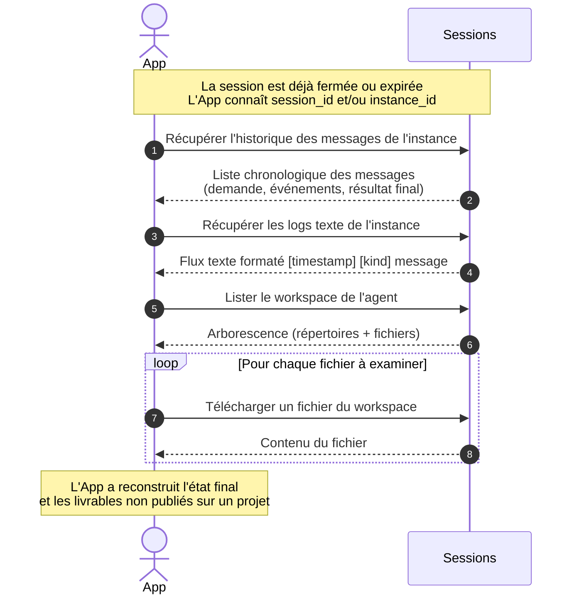

# Cas 09 — Post-mortem d'une session (logs et workspace)

## Contexte

Une fois une session terminée ou un agent détruit, l'application (ou un opérateur
support) peut vouloir **reconstruire ce qui s'est passé** : quels messages ont été
échangés, quels fichiers l'agent a produits dans son workspace, quels logs ont été émis.
C'est essentiel pour le debug, l'audit de conformité, ou la reprise manuelle d'un
travail qui a échoué.

Ce cas couvre la **consultation a posteriori** : la session et les agents ne sont plus
actifs, mais leur trace est accessible en lecture seule.

## Acteurs

| Acteur | Rôle |
|--------|------|
| `App` | Application cliente ou UI d'audit (consulte une session passée) |
| `Sessions` | API publique (endpoints de lecture des messages, logs, workspace) |

## Workflow

## Points clés

- **Les messages sont archivés** : même après fermeture de session, l'historique des messages reste consultable (lecture seule). L'application peut dérouler le scénario complet pour debug.
- **Les logs sont texte libre** : contrairement aux messages MOM (structurés avec `kind`, `direction`, `payload`), les logs d'instance sont un dump texte horodaté. Utile quand l'agent a logué des infos qui ne sont pas remontées comme messages.
- **Le workspace est conservé tant que le container existe** : si la plateforme n'a pas encore nettoyé le container (garbage collector), le workspace est accessible. Au-delà, les fichiers du workspace peuvent être perdus s'ils n'ont pas été poussés sur un projet (voir cas 04).
- **Distinction workspace vs projet** : le workspace est privé à l'instance d'agent, éphémère. Le projet est partagé et persistant. Pour les livrables importants, l'agent doit écrire sur le projet ; le workspace ne sert qu'aux fichiers intermédiaires.
- **Pas de modification post-mortem** : ces endpoints sont en lecture seule. Pour relancer le travail, l'application doit ouvrir une nouvelle session et instancier un nouvel agent (éventuellement en lui passant les fichiers du workspace précédent comme input).
- **Trace côté supervision** : pour un opérateur admin, les endpoints de supervision exposent en plus des compteurs (messages pending/claimed/failed par instance) qui aident à diagnostiquer où le travail s'est bloqué.
