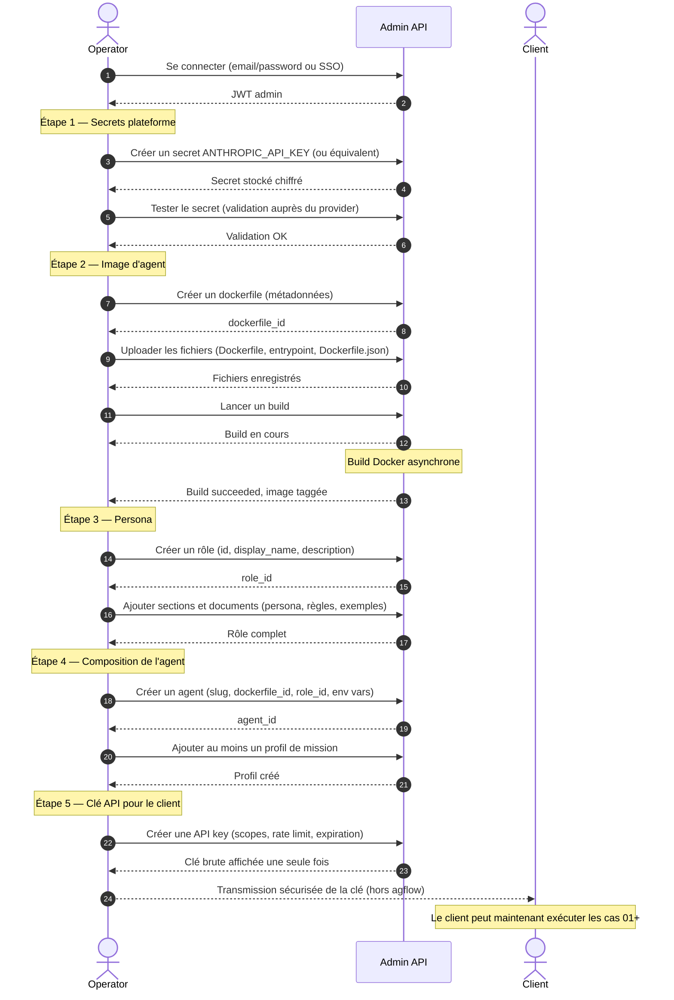

# Scénario A01 — Bootstrap de la plateforme (opérateur)

## Contexte

Avant qu'une application cliente puisse ouvrir une session et instancier un agent,
l'opérateur de la plateforme doit préparer le **minimum viable** : un administrateur
authentifié, au moins un secret de LLM valide, un dockerfile buildé, un rôle, un agent
composé, et une API key livrée au client. Ce scénario décrit ce parcours dans l'ordre
minimal — toute étape omise rend un cas applicatif (01+) inexécutable.

## Acteurs

| Acteur | Rôle |
|--------|------|
| `Operator` | Administrateur humain qui configure la plateforme |
| `Admin API` | Endpoints admin d'agflow (`/api/admin/*`) |
| `Registry` | Registre MCP externe optionnel (non requis ici) |
| `Client` | Application cliente qui recevra l'API key en fin de parcours |

## Workflow

## Points clés

- **Ordre strict** : on ne peut pas composer un agent sans dockerfile + rôle. On ne peut pas livrer une clé API à un client si les scopes mentionnent des capacités inexistantes.
- **Le secret LLM conditionne tout** : sans clé LLM valide, l'agent démarrera son container mais échouera au premier appel. Le test de secret est essentiel avant la composition.
- **Build asynchrone** : le build d'image peut durer plusieurs minutes. L'opérateur suit l'état via l'historique des builds (endpoint dédié). Tant que le build n'est pas `success`, l'agent ne peut pas être instancié en session.
- **Clé API vue une seule fois** : la valeur brute de l'API key n'est retournée qu'à la création. Si perdue, la clé doit être révoquée et recréée. L'opérateur doit livrer au client un canal de transmission sécurisé (password manager, gestionnaire de secrets).
- **Scopes minimaux** : livrer `agents:read agents:run messages:read messages:write` couvre les cas 01-05. Pour le cas 04 (projet + ressources), ajouter les scopes associés.
- **Hors scope ici** : MCP (voir A02), projet + ressources (voir A03), infrastructure (machines SSH, K3s), supervision runtime.

## Ce que ça débloque côté client

- Cas 01 — Demande minimale à un agent
- Cas 02 — Deux agents en parallèle
- Cas 03 — Communication inter-agents
- Cas 05 — Streaming live
- Cas 06 — Session longue avec extension
- Cas 07 — Découverte du catalogue
- Cas 09 — Post-mortem logs et fichiers

Les cas 04 et 08 demandent en plus les scénarios A02 (MCP) et A03 (projets).
