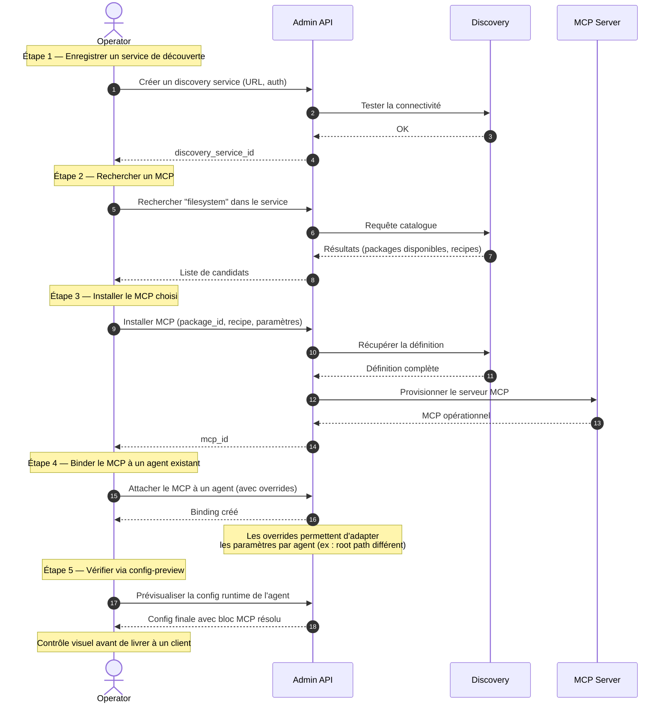

# Scénario A02 — Intégration d'un MCP externe

## Contexte

Le scénario A01 livre un agent fonctionnel mais "nu" : il sait parler à un LLM, pas
plus. Pour qu'il accède à des outils (filesystem, recherche web, base de données, API
externes), l'opérateur doit **installer un MCP** depuis un registre de découverte, puis
**le binder à l'agent**. Ce scénario couvre le parcours complet côté opérateur.

Le client ne voit pas ce parcours directement, mais en bénéficie : son agent sera
capable d'invoquer l'outil MCP pendant le traitement d'une demande (cas 04).

## Acteurs

| Acteur | Rôle |
|--------|------|
| `Operator` | Administrateur |
| `Admin API` | Endpoints admin d'agflow |
| `Discovery` | Registre MCP externe (ex : `mcp.yoops.org`) qui expose un catalogue de MCP installables |
| `MCP Server` | Serveur MCP concret (filesystem, recherche, etc.) déployé après installation |

## Workflow

## Points clés

- **Découplage registre / installation** : un registre peut exposer des dizaines de MCP. L'opérateur n'installe que ceux qu'il veut rendre disponibles. C'est un choix de gouvernance.
- **Recipes multiples par package** : un même MCP peut être installable en plusieurs modes (stdio, sse, http). Le choix dépend du contexte d'exécution de l'agent (container isolé, réseau partagé, etc.).
- **Secrets liés au MCP** : beaucoup de MCP nécessitent une clé API externe (ex : MCP de recherche web). Le secret doit exister dans la plateforme (scénario A01) et être référencé dans les paramètres du MCP à l'installation.
- **Overrides par agent** : un même MCP installé une fois peut être binde à plusieurs agents avec des paramètres différents (ex : chaque agent voit un sous-dossier différent en filesystem).
- **Visibilité runtime** : la prévisualisation de config ne lance pas l'agent, elle montre ce que verrait le container au démarrage. Précieux pour valider la composition avant de livrer.
- **Désinstallation propre** : retirer un MCP casse les bindings existants. Une version future peut ajouter un warning quand un MCP bindé à un agent actif est sur le point d'être désinstallé (hors périmètre actuel).

## Ce que ça débloque côté client

- Cas 04 — Projet, ressources et MCP (la partie MCP du flux)
- Capacités outillées enrichies dans les cas 01-03 (recherche, accès fichiers externes, etc.)
