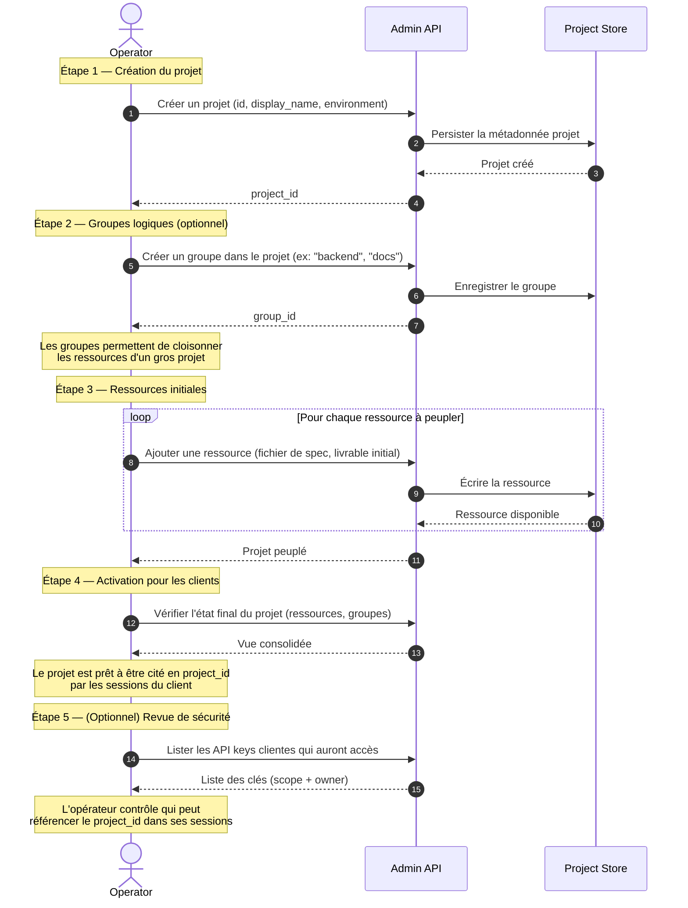

# Scénario A03 — Création d'un projet et de ses ressources

## Contexte

Pour qu'une application puisse rattacher ses sessions à un projet et que ses agents
accèdent à des ressources partagées (fichiers, specs, livrables historiques), l'opérateur
doit **créer le projet** et **le peupler** en amont. Une session liée à un projet
inexistant est refusée ; un projet sans ressources initiales est utilisable mais ne
profite pas de la valeur du contexte persistant.

Ce scénario est le complément du A01 (plateforme) et du A02 (MCP). Il est nécessaire
pour atteindre le cas applicatif 04.

## Acteurs

| Acteur | Rôle |
|--------|------|
| `Operator` | Administrateur |
| `Admin API` | Endpoints admin d'agflow |
| `Project Store` | Stockage des ressources projet (fichiers, instances, groupes) |

## Workflow

## Points clés

- **Projet = conteneur persistant** : contrairement à une session (éphémère), les ressources d'un projet survivent à toutes les sessions qui l'utilisent. C'est le lieu où les agents déposent leurs livrables durables.
- **Groupes facultatifs** : pour un petit projet, les ressources peuvent être à plat. Les groupes deviennent utiles quand le projet couvre plusieurs domaines (backend / frontend / docs) et qu'on veut restreindre certains agents à un sous-ensemble.
- **Ressources pré-existantes vs générées** : l'opérateur peut peupler le projet à la main (spec initiale, modèles, données de référence). Les agents ajouteront ensuite leurs livrables. Les deux coexistent.
- **Pas d'ACL par utilisateur sur le projet** : actuellement, tous les clients avec les bons scopes peuvent rattacher une session à n'importe quel projet. Pour affiner ça, il faudra la future table `session_users` (hors périmètre).
- **Suppression destructive** : supprimer un projet détruit ses ressources. Pas de corbeille pour l'instant. À manipuler avec soin côté UI admin.
- **Pas obligatoire pour démarrer** : les cas 01-03, 05-09 se passent de projet. Le projet ne devient nécessaire que si on veut du contexte persistant entre sessions.

## Ce que ça débloque côté client

- Cas 04 — Projet, ressources et MCP (la partie ressources du flux)
- Patterns multi-sessions sur un même projet (itérations successives, reprise de travail)
